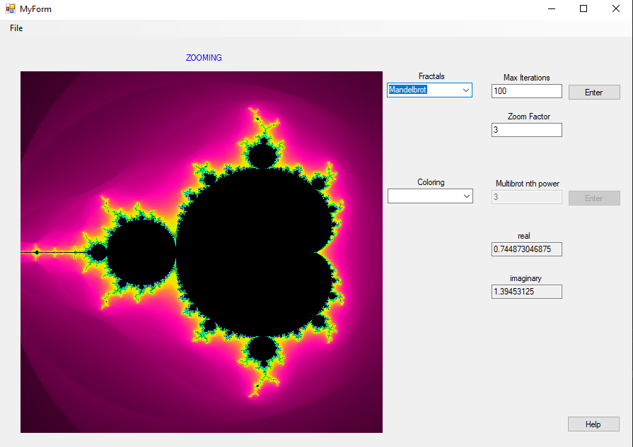
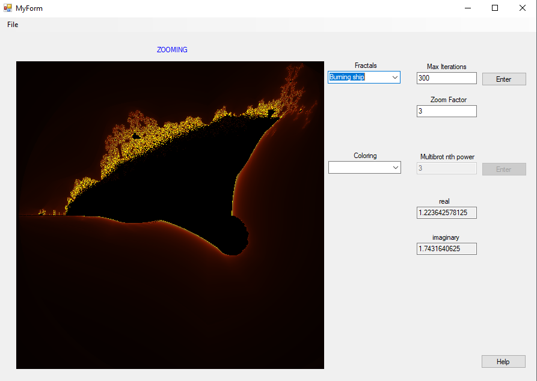
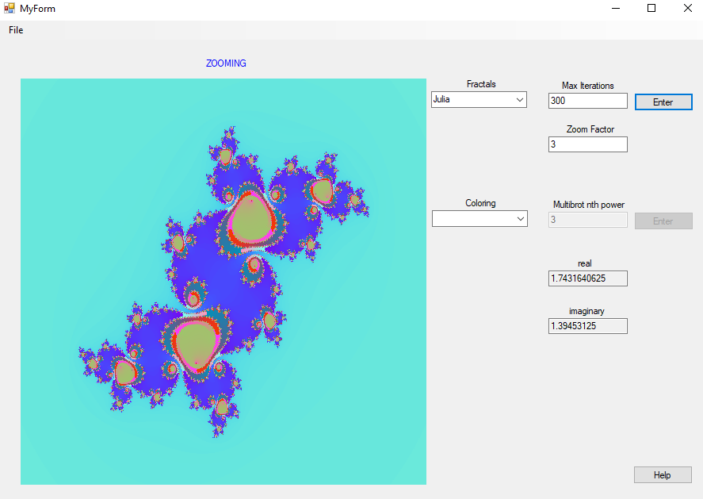
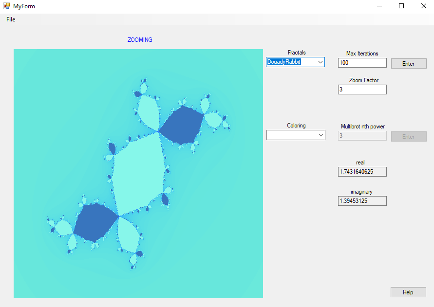
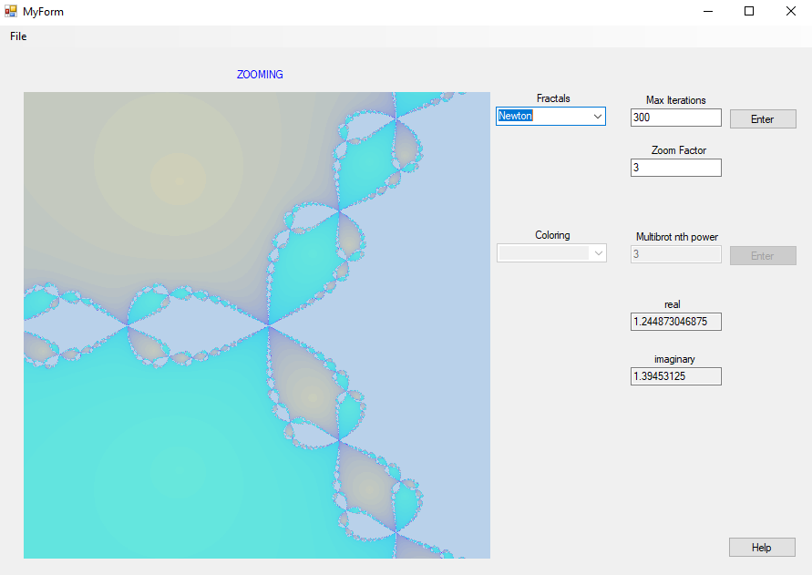
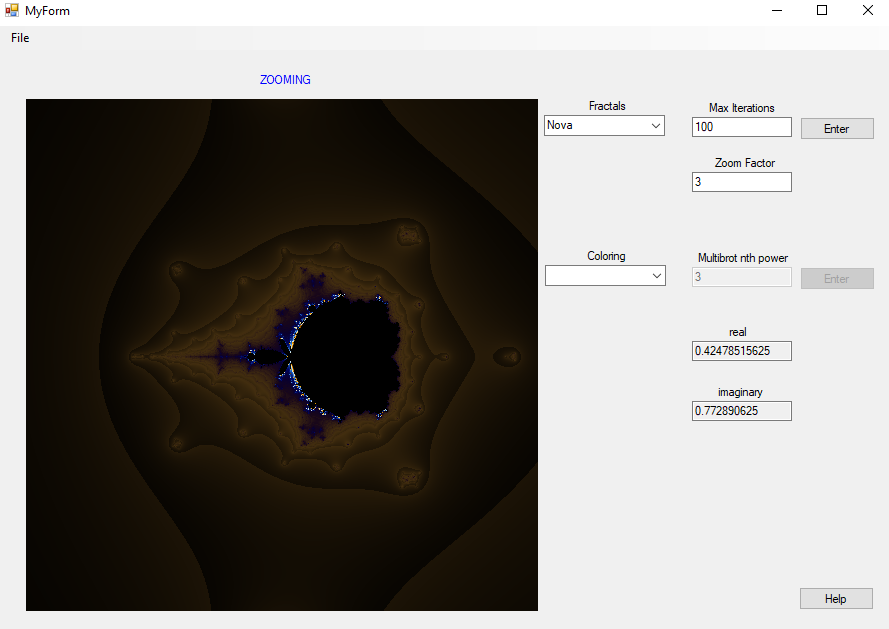
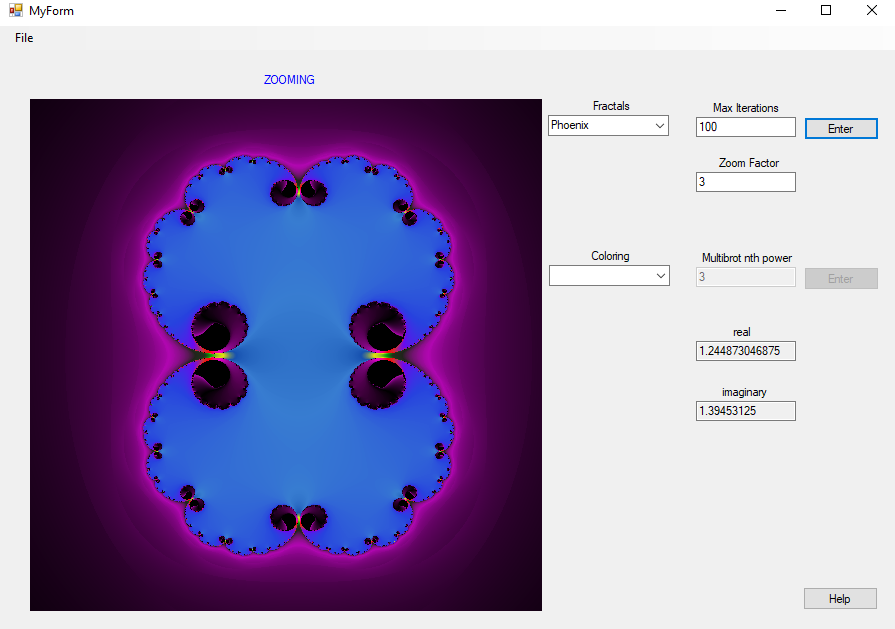
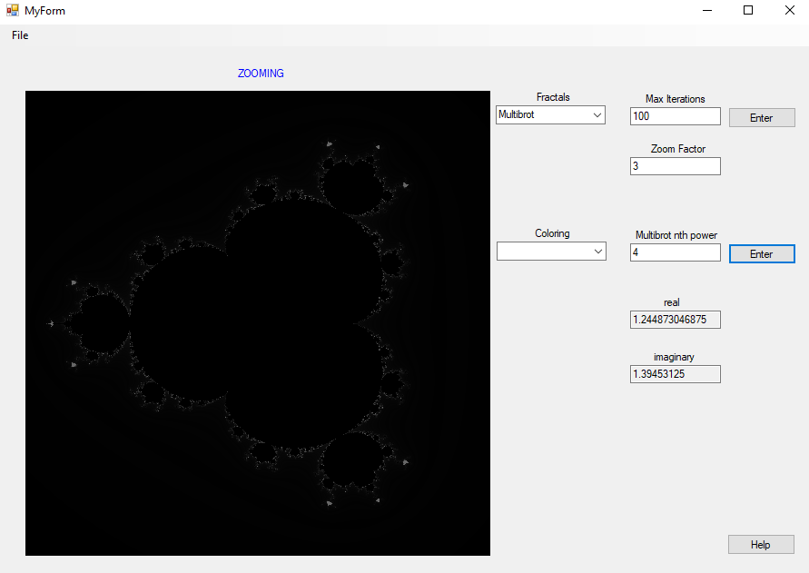
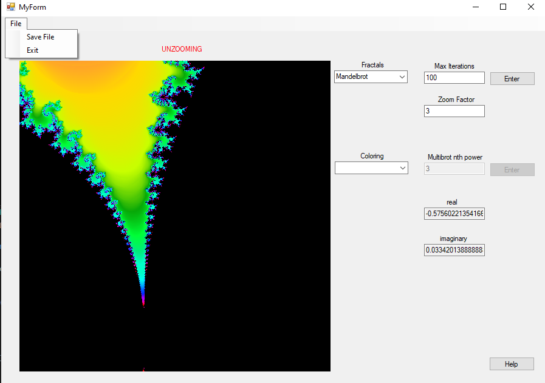
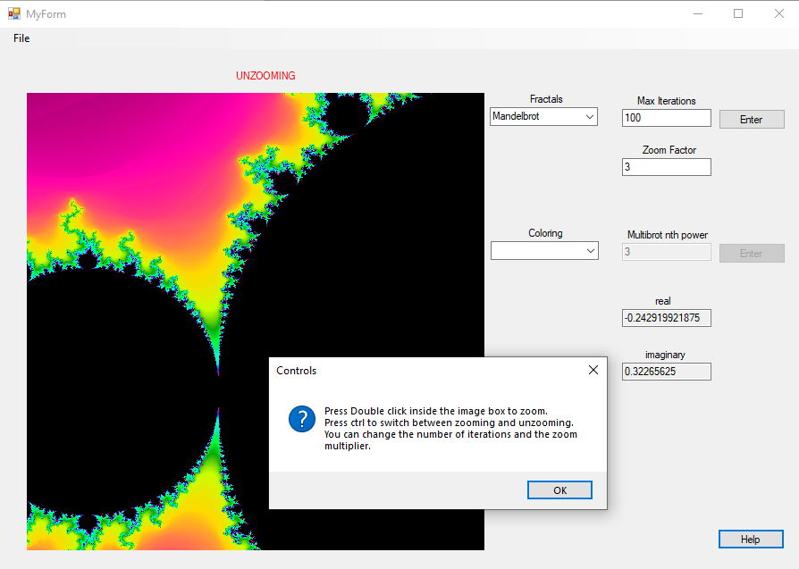

# Fractal Explorer using .NET
This is my thesis project written in C++. It's a real time interactive Fractal explorer. I implemented 8 different Fractals with smooth coloring in which the user can explore (zoom/unzoom) at any direction.

## How to run
* Install **Visual Studio**
* Install C++/CLI from individual components (not necessary)
* Open FractalExplorer.sln with Visual Studio

## Controls
You can zoom by double clicking on the bitmap and by pressing Ctrl you switch from zooming to unzooming and vice versa. You can change the max iterations and the zoom factor.

## Showcase
### 
 Mandelbrot

### 
 The Burning Ship

### 
 Julia Set

### 
 Douady Rabbit

### 
 Newton

### 
 Nova

### 
 Phoenix

### 
 Multibrot

 Mandelbrot has a dedicated textbox to initialize the Nth power of the function f(n)= z^n + c.  

## Features 
You can also save the image and check the controls by pressing the Help button.
With the **coloring** combobox you can choose the color of the rendered Fractal.
### 
 

